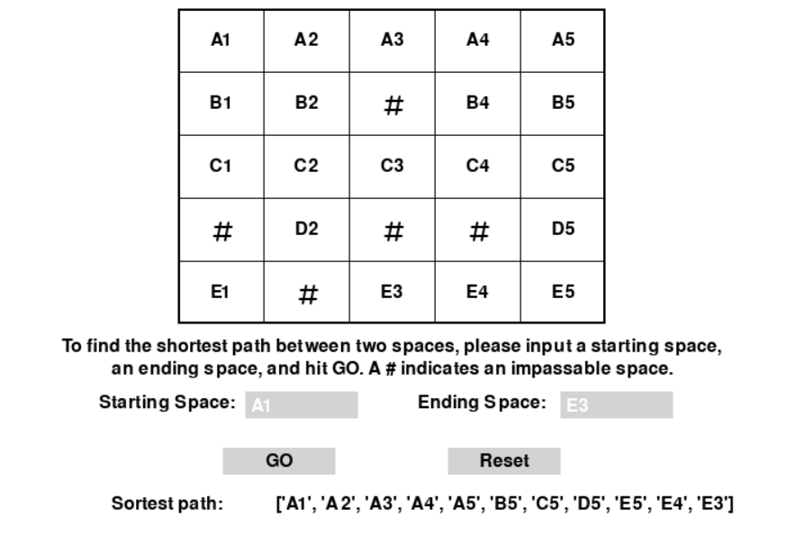

# GraphTraversalPuzzleSolver 
The main program, Puzzle.py, includes a function that can find the shortest path from point A to point B in a given 2D array using a breadth-first search (BFS) algorithm. The function takes a 2D array that represents a board, a touple with starting coordinates, and a touple with ending coordinates. The function will then return a list containing all the visited coordinates in the shortest path and a string of directions (U, D, L, R) the path takes through the board.

Board.py is a small game made with pygame that visualizes Puzzle.py. 

Converter.py converts the letter/number coordinates (A1, B2, etc.) into the equivalent (x, y) coordinates used by Puzzle.py, and vice versa.

## How to Use Puzzle.py
To use Puzzle.py, call the function solve_puzzle() with a 2D array for the board, a touple representing the (x, y) starting coordinates, and a touple representing the (x, y) ending coordinates. The coordinates are zero-indexed to match the 2D array. 

### 2D array example
The array should consist of '-' representing a passable space, and '#' representing an impassable space.
  
`array_example_1 = [
    ['-', '-', '-', '-', '-'],
    ['-', '-', '#', '-', '-'],
    ['-', '-', '-', '-', '-'],
    ['#', '-', '#', '#', '-'],
    ['-', '#', '-', '-', '-']
]`
 
`array_example_2 = [
    ['-', '-', '-'],
    ['-', '#', '-'],
    ['-', '-', '-']
]`

### Calling solve_puzzle()
`solve_puzzle(array_example_1, (0, 2), (2, 2))`
## How to Use Board.py
Run Board.py within Pycharm (or any development environment that can use Python). A new screen will pop up containing a board and two boxes to input a starting space and an ending space. Simply pick two spaces from the board, type them into the input boxes, and click GO. The shortest path between the two points will be printed on the screen.
 

